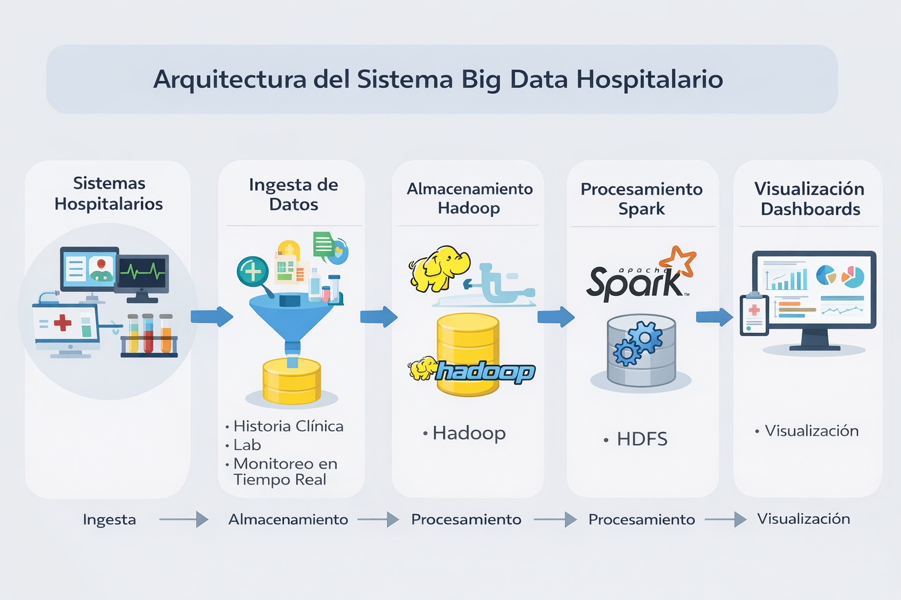

#  Caso Práctico IDL3 – Solución Big Data en Sistema Hospitalario

---

##  Introducción
Este proyecto propone una solución basada en Big Data para mejorar la gestión de datos en un sistema hospitalario, optimizando el procesamiento, almacenamiento y análisis de grandes volúmenes de información.

---

## 1. Identificación de requisitos y desafíos

###  Desafíos:
- Alto volumen de datos clínicos y administrativos  
- Lentitud en el acceso a información médica  
- Falta de integración entre áreas hospitalarias  
- Crecimiento del 50% en los próximos años  
- Riesgos en la seguridad de datos  

###  Requisitos:
- Procesamiento rápido de datos  
- Escalabilidad del sistema  
- Integración de múltiples fuentes  
- Análisis en tiempo real  
- Seguridad y privacidad  

---

## 2. Propuesta de solución

### Arquitectura:
1. Ingesta de datos  
2. Almacenamiento en Hadoop  
3. Procesamiento con Apache Spark  
4. Visualización con dashboards  

###  Características:
- Alta disponibilidad  
- Procesamiento distribuido  
- Escalabilidad  

---

## 3. Pruebas de escalabilidad

### Estrategia:
- Simulación de crecimiento del 50%  
- Pruebas de carga  
- Evaluación del rendimiento  

###  Métricas:
- Tiempo de respuesta  
- Uso de CPU y memoria  
- Latencia  
- Capacidad de almacenamiento  

---

## 4. Integración de tecnologías

- Hadoop  
- Apache Spark  
- MongoDB  
- Python / SQL  
- Power BI  

###  Justificación:
Estas tecnologías permiten manejar grandes volúmenes de datos de forma eficiente, garantizando escalabilidad y procesamiento en tiempo real en el sector salud.

---

## 5. Estrategias de mejora continua

- Monitoreo constante del sistema  
- Optimización de procesos  
- Actualización tecnológica  
- Mejora del rendimiento  

###  Seguridad:
- Encriptación de datos  
- Control de accesos  
- Protección de datos sensibles  

---

## 6. Impacto esperado

- Mejora en la atención al paciente  
- Reducción de tiempos de respuesta  
- Toma de decisiones en tiempo real  
- Mayor eficiencia operativa  

---

## 7. Comparación

### Antes:
- Procesamiento lento  
- Datos fragmentados  
- Baja eficiencia  

### Después:
- Procesamiento rápido  
- Datos integrados  
- Sistema escalable  

---

## 📚 Referencias
- Documentación oficial de Apache Hadoop  
- Documentación oficial de Apache Spark  

## Arquitectura

---

## 🖼️ Arquitectura

Arreglar nombre del README

